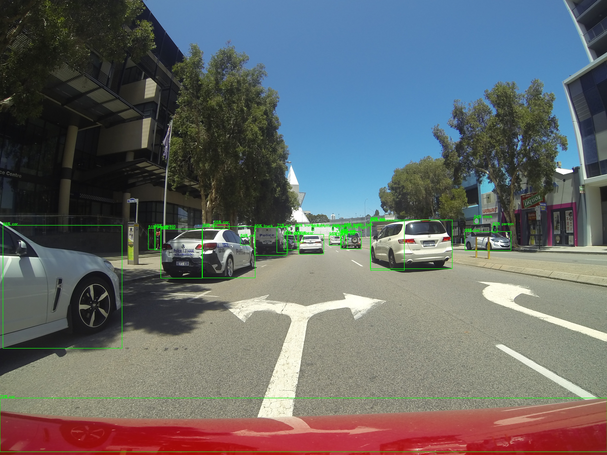
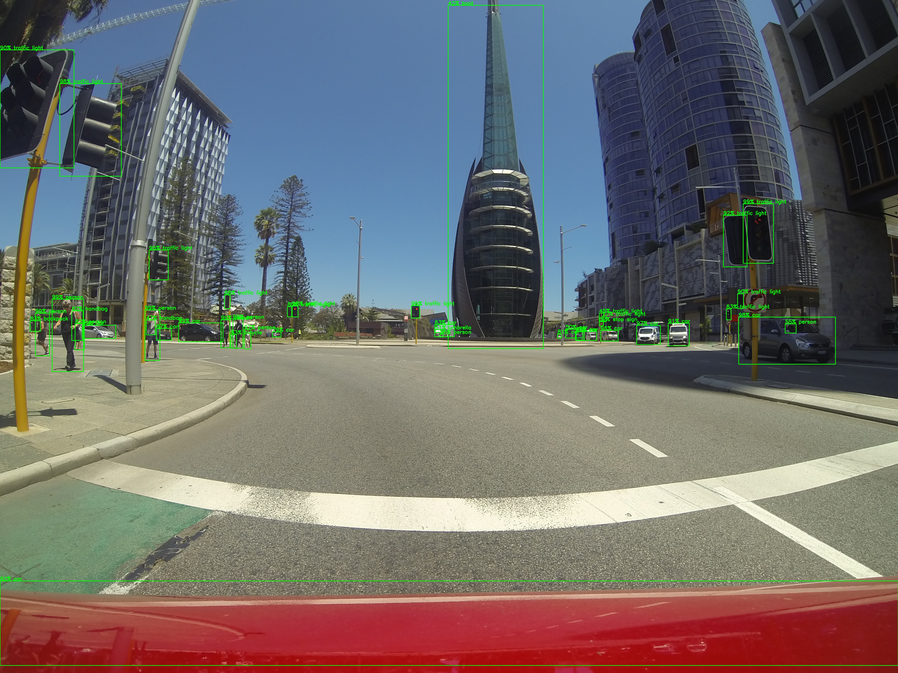
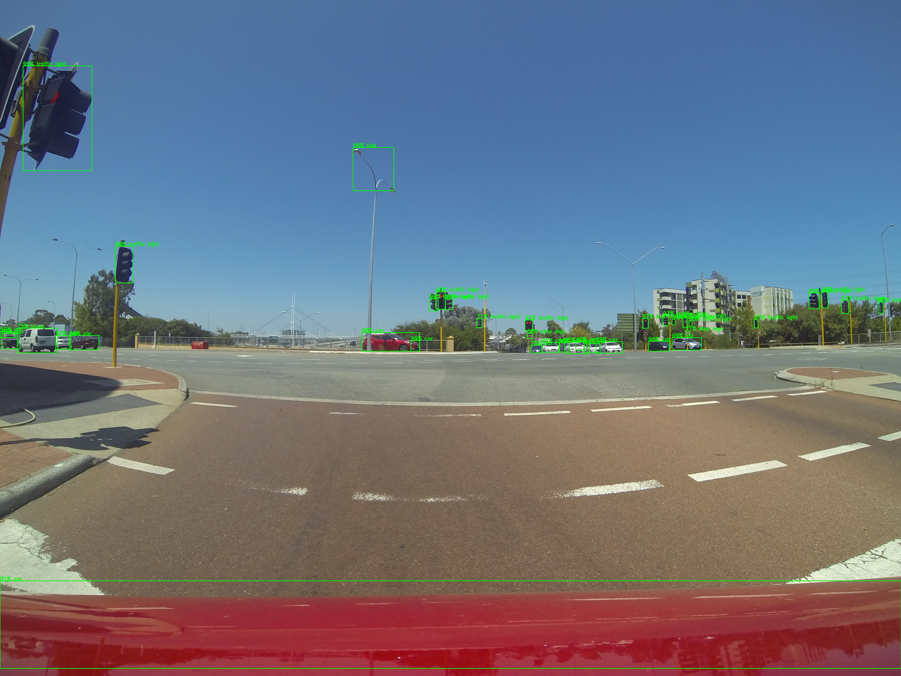

# Automatically Labeling Datasets

This project is just for testing a concept on how to approach labeling a new dataset for object detection. 

The current problem is that while many services exist for creating ground truth labeling for datasets exist (such as Amazon Mechanical Turk) they will inevitably lead to costly human labelers wasting time on very easy detections. It could be beneficial to first use existing pre-trained models to find as many easily detections and pre-label them as well as nominate bounding boxes that require human review for verification. 

In this project i've used 3 pre-trained models on a image set collected using a go-pro driving around Perth City;
1. Retinanet
2. Mask R-CNN
3. Cascade R-CNN

The detections generated from these 3 models and combined and then using Non-Maximum Suppression duplicate detections can be removed. This produces an initial set of detections with acceptable confidence. Currently the biggest issue appears to be partial duplicate detections ,detecting an entire car then a second detection of a small part of it, that NMS misses.  

The next step is to creating a method where each model effectively gets a 'vote' on each detection to create a more nuanced set of detections labeled as either high confidence or requiring human review.  This will also need to identify erroneous classes such as a labeling a street light as kite. 
 
This is an earlier stage project, no shareable code yet. 
 

